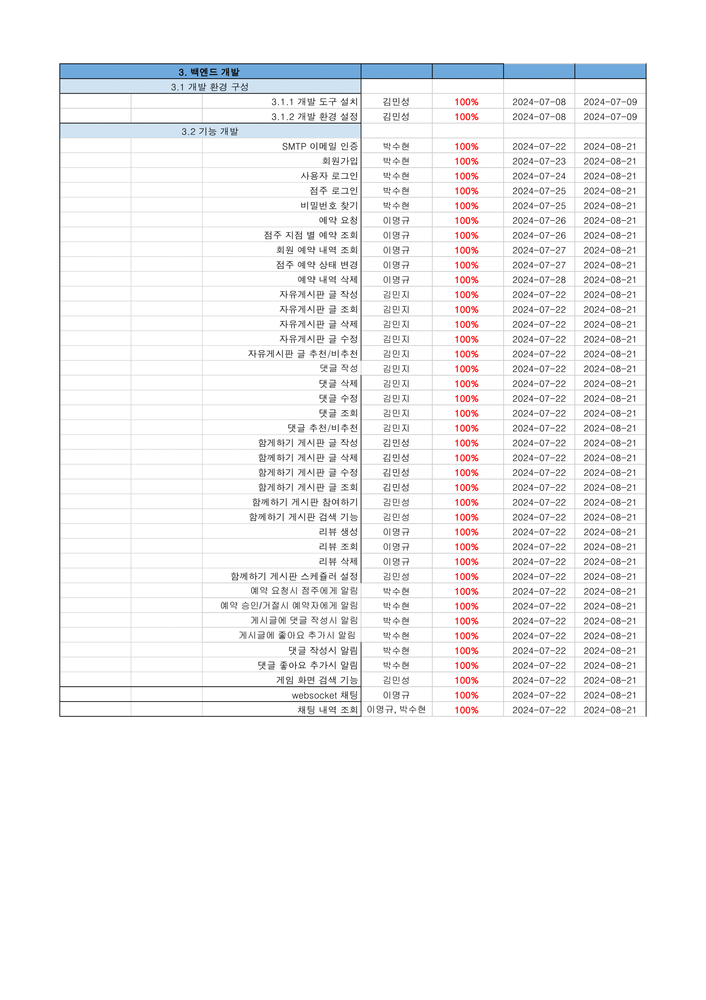
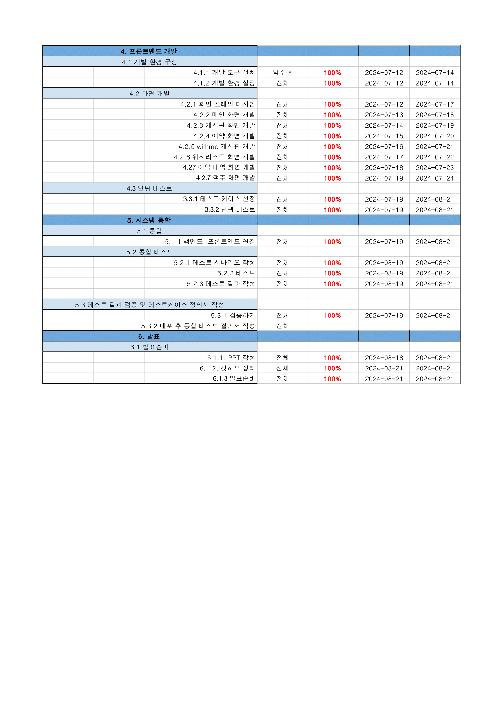
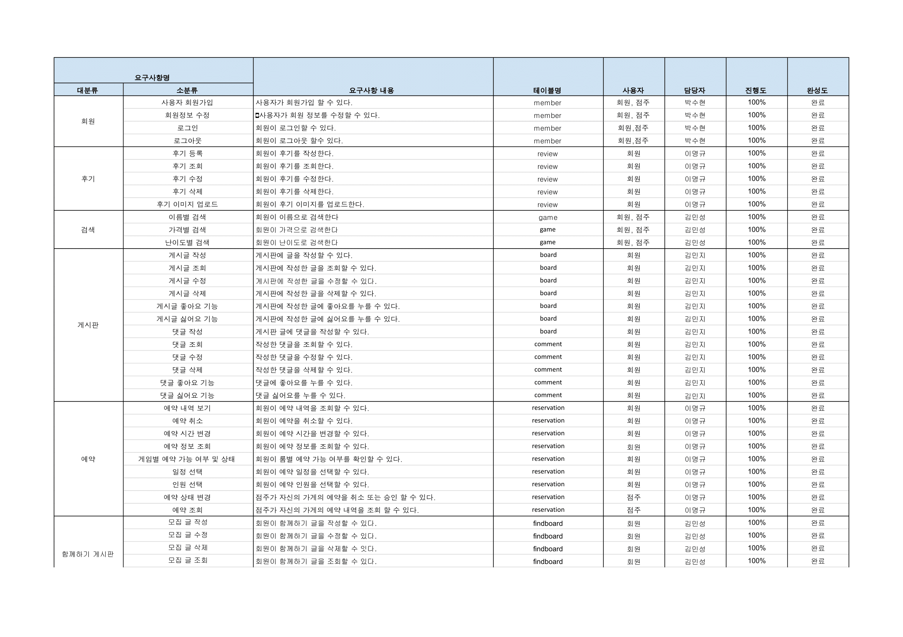
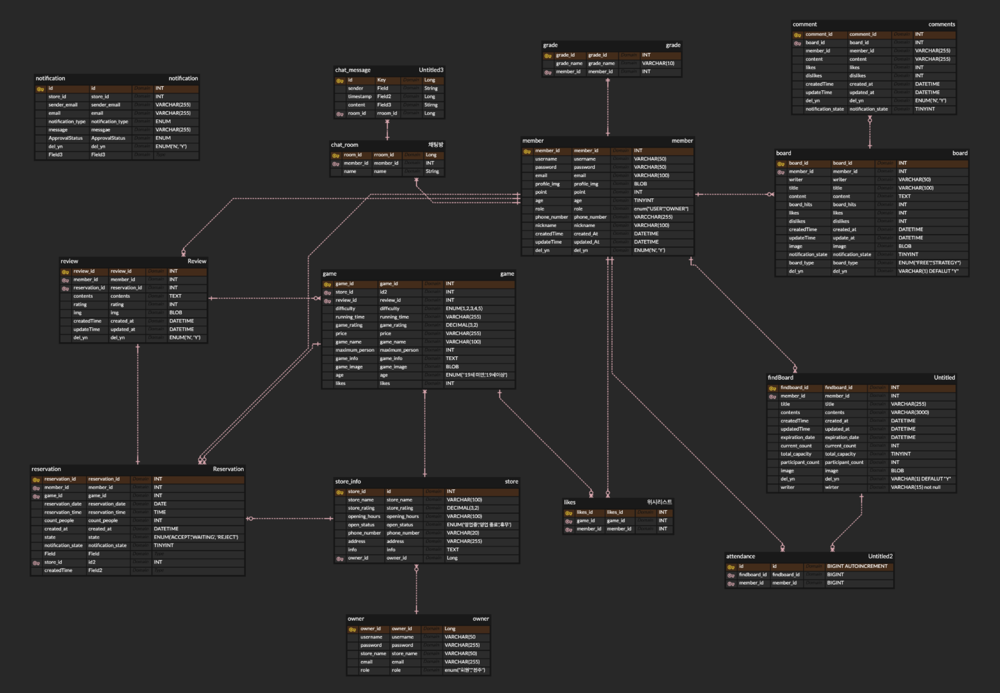

	

### 방탈출 만을 고려하는 찐 방탈출러 덕후들을 위한 커뮤니티
NoExit은 전국의 방탈출 게임을 하나의 플랫폼에서 손쉽게 검색, 예약, 리뷰 확인,커뮤니티 참여, 참가인원 모집까지 할 수 있는 통합 플랫폼 서비스 입니다.   
방탈출 게임을 사랑하는 유저들에게 편리한 서비스를 제공하며 방탈출 카페 업주들에게는 효율적인 마케팅과 고객 관리 도구를 제공하여  
마이너한 문화에서 메이저한 문화로 발전한 방탈출 문화를 더욱 활성화 하는 것을 목표로 합니다.

 

## 🙋🏻팀원

| **김민성** | **김민지** | **박수현** | **이명규** |
| :------: |  :------: | :------: | :------: |
| [   @Windowmincastle](https://github.com/Windowmincastle) | [   @epiuwiruiw](https://github.com/epiuwiruiw) | [   @34suuuuu](https://github.com/34suuuuu) | [   @leem5514](https://github.com/leem5514) |

 

 

	

 

## 🛠 기술 스택

###  DB

### BACKEND

### FRONTEND

### TOOLS

 

## 🗓️ WBS
[🗓️ NoExit - WBS 확인하러 가기](https://docs.google.com/spreadsheets/d/1VdXKl6pfghy9OK6zTpShCHeG1uyAGB85Y2ycm1viF5g/edit?gid=1200936578#gid=1200936578)

 

## 📝 요구사항정의서
[📝 NoExit - 요구사항 정의서 확인하러 가기](https://docs.google.com/spreadsheets/d/1VdXKl6pfghy9OK6zTpShCHeG1uyAGB85Y2ycm1viF5g/edit?gid=566809607#gid=566809607)

 

## 📋 ERD

 

	

   
  
## ⚔️ NoExit의 경쟁력
  - 불편한 예약 서비스 체계에서 벗어나 많은 방탈출 게임 정보를 제공합니다.
  - 정교한 필터링 기능으로 사용자 맞춤형 추천 기능을 제공합니다.
  - 사용자 리뷰 및 평점 시스템을 통해 신뢰할 수 있는 정보를 제공합니다.
  - 유저 간 활발한 커뮤니티를 통해 지속적인 유입과 참여를 유도하며 함께하기 기능을 통해 점주는 매출 증대를 기대할 수 있습니다.
  - 업주에게 효율적인 예약 시스템을 제공하여 효율적인 비즈니스 운영을 지원합니다.

   
    

## 📌 주요 기능
- 참여 게시판
  - 방탈출 게임을 함께하기위해 원하는 게임, 시간, 인원을 선택하여 사람들은 모집할 수 있습니다.
  - 인원이 가득찬다면 자동을 채팅방을 생성해 참여 인원들에게 초대메시지를 보내, 해당 인원들은 초대메시지를 통해 채팅방에 참여할 수 있습니다.
- 검색 기능
  - 게임을 카테고리별, 금액별, 난이도별로 검색할 수 있습니다.
- 예약
  - 사용자가 예약을 요청하면 점주는 예약 요청에 대한 알림을 받을 수 있습니다.
  - 점주의 예약 승인/거절 여부에 대해서 사용자는 알림을 받을 수 있습니다. 

    

	

## ✨ 기능 테스트

  <b> 게시판</b>

  

    <ul>
      <li>게시판 글 작성</li>
      <li>게시판 글 수정 및 삭제</li>
      <li>게시판 글 검색(제목, 카테고리, 내용)</li>
      <li>게시판 글 추천/비추천</li>
      <li>뎃글 작성 및 수정</li>
      <li>댓글 추천/비추천</li>
    </ul>
  

  

    <b>Escape With me</b>
  

  

    <ul>
      <li>모집글 작성</li
      <li>모집글 삭제</li>
      <li>모집글 참여</li>
    </ul>
  

  

    <b>예약 및 리뷰 작성</b>
  

  

    <ul>
      <li>예약 요청</li>
      <li>[점주]예약 거절 및 승인</li>
      <li>리뷰 작성 및 조회</li>
      <li>리뷰 수정 및 삭제</li>
    </ul>
  

  

    <b>알림</b>
  

  

    <ul>
      <li>알림 목록 조회</li>
    </ul>
  

  

    <b>실시간 채팅</b>
  

  

    <ul>
      <li>실시간 채팅</li>
    </ul>
  

